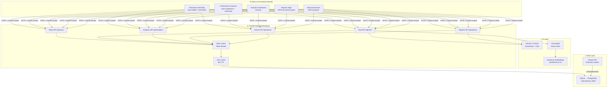

<div align="center">

# 🇮🇳 India Pulse AI

### Real-Time AI-Powered News Intelligence for India

[](https://nextjs.org/)
[](https://fastapi.tiangolo.com/)
[](https://www.typescriptlang.org/)
[](https://www.python.org/)
[](LICENSE)

> An interactive geospatial news platform that combines real-time data collection, AI-powered summaries, semantic search (RAG), sentiment analysis, and an AI research assistant — visualized on a live map of India.

**[Live Demo](https://india-pulse-ai.vercel.app)** · **[API Docs](https://your-backend.railway.app/api/docs)** · **[Report Bug](https://github.com/kulatshreeram/India-Pulse-AI/issues)**

</div>

---

## ✨ Features

| Category | Features |
|---|---|
| 🗺️ **Interactive Map** | Click-to-explore India map with news markers, heatmap mode, clustering, GeoJSON state overlays |
| 📰 **News Intelligence** | Real-time collection, AI summaries (Gemini/OpenAI), sentiment analysis, breaking news detection |
| 🤖 **AI Research Assistant** | Multi-mode chatbot with Daily Briefing, Weekly Reports, State Reports, Topic Analysis, Trend Explanation |
| 📊 **Analytics Dashboard** | Trending topics, sentiment charts, state activity, category breakdowns, timeline explorer |
| 🔍 **Advanced Search** | Semantic search (RAG with ChromaDB), fuzzy matching, state/category/date filters, search history |
| 🔔 **Notifications** | Real-time breaking news alerts, in-app notification center |
| 📈 **Report Generation** | Export AI reports as Markdown, TXT, JSON, CSV, or Print-to-PDF |
| 🌐 **Multilingual** | English, Hindi (हिंदी), Marathi (मराठी) UI + AI responses |
| 📱 **Mobile-First** | Responsive design, hamburger nav drawer, touch-optimized map |
| ⚖️ **State Comparison** | Side-by-side comparison of news volume, sentiment, categories across states |

---

## 🏗️ Architecture



---

## 🚀 Quick Start

### Prerequisites
- Node.js 20+ and npm
- Python 3.10+
- API keys: [GNews](https://gnews.io/) and [Google AI Studio (Gemini)](https://aistudio.google.com/) or [OpenAI](https://platform.openai.com/)

### 1. Clone the repository
```bash
git clone https://github.com/kulatshreeram/India-Pulse-AI.git
cd India-Pulse-AI
```

### 2. Configure environment variables
```bash
cp .env.local.example .env.local
# Edit .env.local and fill in your API keys
```

### 3. Install frontend dependencies
```bash
npm install
```

### 4. Install backend dependencies
```bash
cd backend
pip install -r requirements.txt
cd ..
```

### 5. Start both servers

**Terminal 1 — Backend (FastAPI):**
```bash
uvicorn backend.app.main:app --reload --port 8000
```

**Terminal 2 — Frontend (Next.js):**
```bash
npm run dev
```

Open [http://localhost:3000](http://localhost:3000) 🎉

---

## ⚙️ Environment Variables

| Variable | Required | Description |
|---|---|---|
| `GEMINI_API_KEY` | ✅ | Google Gemini API key for AI summaries |
| `OPENAI_API_KEY` | Optional | OpenAI fallback for AI chat |
| `GNEWS_API_KEY` | ✅ | GNews API key for real-time articles |
| `DATABASE_URL` | Optional | PostgreSQL URL (defaults to SQLite) |
| `ALLOWED_ORIGINS` | Prod only | Comma-separated allowed CORS origins |
| `NEXT_PUBLIC_APP_URL` | Optional | Your frontend URL for SEO metadata |

---

## 📁 Project Structure

```
India-Pulse-AI/
├── src/                          # Next.js frontend
│   ├── app/                      # App Router pages
│   │   ├── dashboard/            # Interactive map page
│   │   ├── assistant/            # AI research assistant
│   │   ├── analytics/            # Analytics dashboard
│   │   ├── search/               # Advanced search
│   │   ├── compare/              # State comparison
│   │   ├── reports/              # Report generation
│   │   └── api/                  # Next.js API proxies
│   ├── components/               # Reusable components
│   │   ├── map/                  # Leaflet map components
│   │   ├── news/                 # News panels & cards
│   │   ├── layout/               # Navbar, MobileNav
│   │   ├── notifications/        # Notification center
│   │   └── onboarding/           # First-visit tour
│   ├── hooks/                    # React custom hooks
│   ├── store/                    # Zustand state stores
│   └── types/                    # TypeScript definitions
│
├── backend/                      # FastAPI backend
│   ├── app/
│   │   ├── routes/               # API endpoint handlers
│   │   ├── models/               # SQLAlchemy ORM models
│   │   ├── services/             # AI, news fetching logic
│   │   ├── middleware/           # Rate limiting, logging
│   │   └── cache.py              # In-memory LRU cache
│   └── vector_store/             # ChromaDB RAG pipeline
│
├── public/
│   └── india-states.geojson      # India state boundaries
│
└── docs/                         # Architecture & API docs
```

---

## 🛠️ Tech Stack

**Frontend**
- [Next.js 15](https://nextjs.org/) — App Router, Server Components
- [TypeScript](https://www.typescriptlang.org/) — Full type safety
- [React Leaflet](https://react-leaflet.js.org/) — Interactive map
- [Recharts](https://recharts.org/) — Analytics charts
- [Framer Motion](https://www.framer.com/motion/) — Animations
- [Zustand](https://zustand-demo.pmnd.rs/) — State management
- [TanStack Query](https://tanstack.com/query) — Server state & caching
- [Tailwind CSS](https://tailwindcss.com/) — Styling

**Backend**
- [FastAPI](https://fastapi.tiangolo.com/) — Async Python API
- [SQLAlchemy](https://www.sqlalchemy.org/) — ORM + migrations
- [ChromaDB](https://www.trychroma.com/) — Vector database (RAG)
- [Google Gemini](https://ai.google.dev/) — AI summaries & chat
- [GNews API](https://gnews.io/) — Real-time news articles
- [Sentence Transformers](https://www.sbert.net/) — Embeddings

---

## 📖 Documentation

- [Architecture Guide](docs/ARCHITECTURE.md)
- [API Reference](docs/API.md)
- [Deployment Guide](docs/DEPLOYMENT.md)

---

## 🤝 Contributing

Pull requests are welcome! For major changes, please open an issue first.

```bash
git checkout -b feature/your-feature
git commit -m "feat: describe your feature"
git push origin feature/your-feature
```

---

## 📄 License

[MIT](LICENSE) © 2024 India Pulse AI
