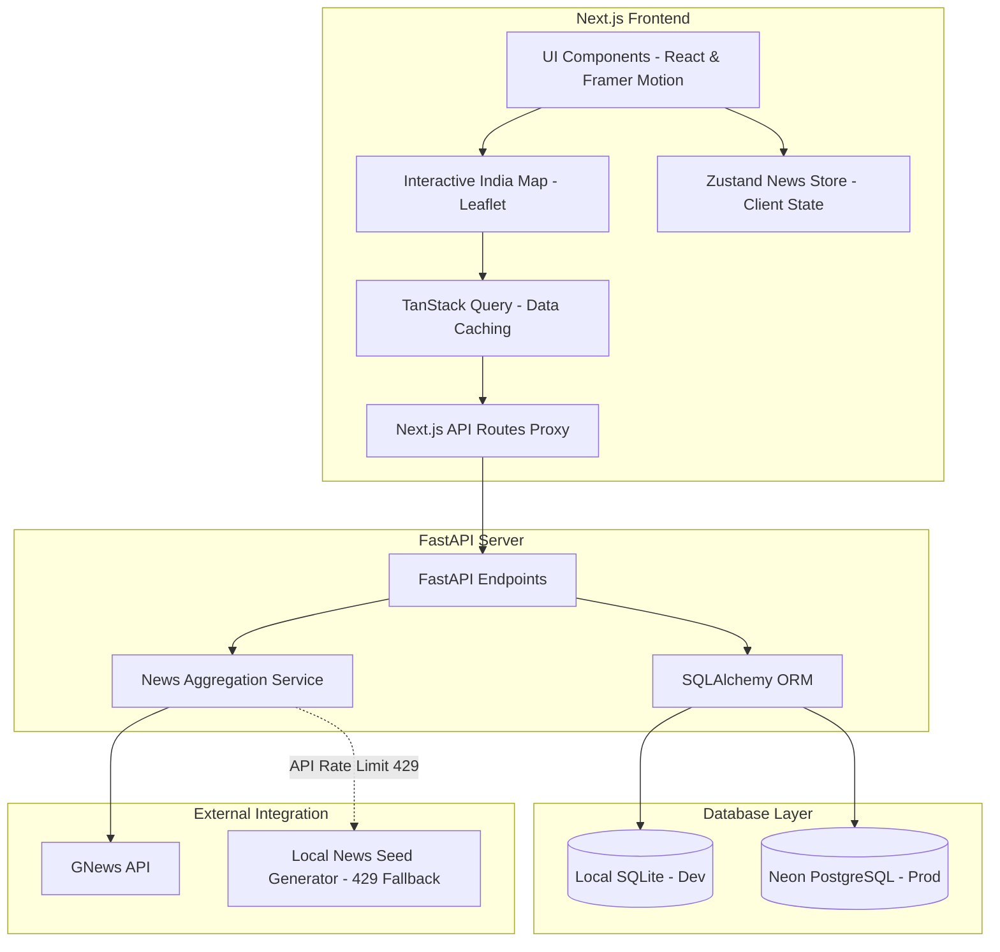

# ⚡ India Pulse AI

> Real-time AI-powered news intelligence platform for India. Explore geo-tagged news on an interactive map, get automated AI summaries, analyze regional sentiment, and search regional events across all 28 states.


---

## 🗺️ Interactive Live Demo Preview

Users visiting the platform can:
- **Explore the India Map**: Hover over state boundaries to view live story counts, click states to display local articles, and toggle **Heatmap Mode** to color-code states by news density.
- **Search Topics & States**: Instantly filter articles by state names, news headlines, and categories.
- **Read AI Insights**: View detailed side panels with local-to-global impact metrics, category badges, sentiment scales, and AI summaries.

---

## 🚀 Architecture Diagram



---

## ✨ Features List

- **Interactive Map of India**: Styled with dark glassmorphism overlays and custom map tooltips displaying real-time state counts (e.g. `Maharashtra (15)`).
- **Resilient Backend Caching**: Mitigates GNews API rate limiting by dynamically storing articles in SQLite/PostgreSQL. If the API hits a `429 Too Many Requests` error, a local news seeder automatically generates realistic regional articles on-the-fly.
- **Category Filter Tabs**: Instantly filter news by `Politics`, `Technology`, `Startups`, `Business`, `Sports`, `Entertainment`, `Health`, `Weather`, and more.
- **Unified Global Search**: Autocomplete search that queries both articles and state metadata in a single roundtrip.
- **AI Summary Panel**: Sliding drawer showing sentiment score graphs, local/state/national/global impact scales, and a GPT-style AI summary.
- **Responsive Layout**: Designed for mobile, tablet, and desktop screens with interactive touch-targets and spring-based drawer animations.

---

## 🛠️ Tech Stack

- **Frontend**: Next.js 15 (App Router), React 19, TypeScript, Tailwind CSS, Zustand, TanStack React Query v5, Framer Motion.
- **Mapping**: Leaflet.js, React Leaflet, Leaflet MarkerCluster.
- **Backend**: FastAPI (Python 3.11+), SQLAlchemy ORM, Pydantic v2.
- **Database**: SQLite (local development), PostgreSQL / Neon DB (production).
- **Deployment**: Vercel (Frontend), Render / Railway (Backend).

---

## ⚙️ Installation & Local Setup

### 1. Clone the Repository
```bash
git clone https://github.com/kulatshreeram/India-Pulse-AI.git
cd India-Pulse-AI
```

### 2. Configure Environment Variables

**Frontend (`.env.local`)**:
```env
NEXT_PUBLIC_APP_URL=http://localhost:3000
```

**Backend (`backend/.env`)**:
```env
GNEWS_API_KEY=your_gnews_api_key_here
DATABASE_URL=sqlite:///./india_pulse.db
```

### 3. Run FastAPI Backend
Ensure Python 3.11+ is installed, then:
```bash
cd backend
python -m venv .venv
# Activate virtual environment
# On Windows:
.venv\Scripts\activate
# On Linux/macOS:
source .venv/bin/activate

pip install -r requirements.txt
uvicorn app.main:app --reload --port 8000
```
*Note: The database is automatically created and seeded with mock regional articles on first run.*

### 4. Run Next.js Frontend
Open a new terminal window in the root directory:
```bash
npm install
npm run dev
```
Explore the application at `http://localhost:3000`.

---

## 🌐 Deployment Plan

### Database Setup (Neon PostgreSQL)
1. Sign up on [Neon.tech](https://neon.tech/) and create a PostgreSQL database.
2. Copy the Connection String.
3. Add `DATABASE_URL` to the backend deployment environment variables. The connection module automatically handles scheme rewriting from `postgres://` to `postgresql://`.

### Backend Deployment (Render or Railway)
1. Create a new Web Service pointing to your GitHub repository.
2. Set the build command to `pip install -r backend/requirements.txt` (or configure root directory as `/backend`).
3. Set the start command to `uvicorn backend.app.main:app --host 0.0.0.0 --port $PORT`.
4. Configure environment variables:
   - `DATABASE_URL`: Your production Neon DB connection string.
   - `GNEWS_API_KEY`: Your GNews token.

### Frontend Deployment (Vercel)
1. Import the repository on Vercel.
2. Set Framework Preset to **Next.js**.
3. In settings, add Next.js API rewrites or configure the API route handlers to point to the production backend URL (e.g. update `backendUrl` in `src/app/api/.../route.ts` to reference the backend domain).

---

## 📄 License

This project is licensed under the MIT License - see the [LICENSE](LICENSE) file for details.
